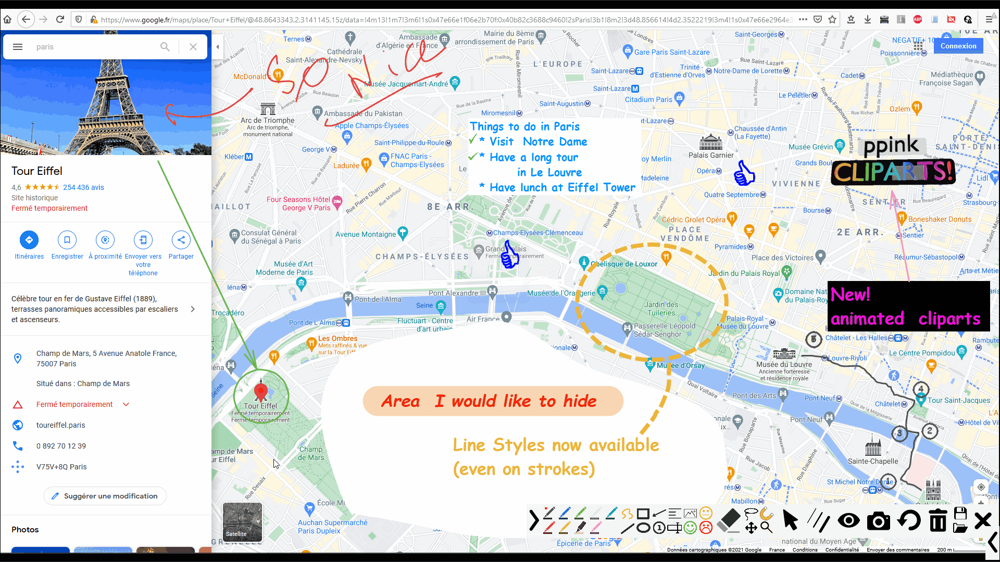
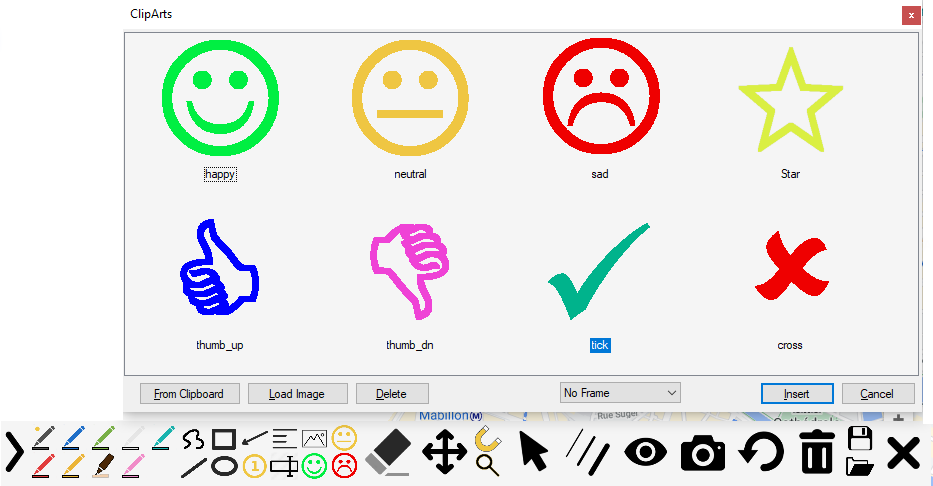
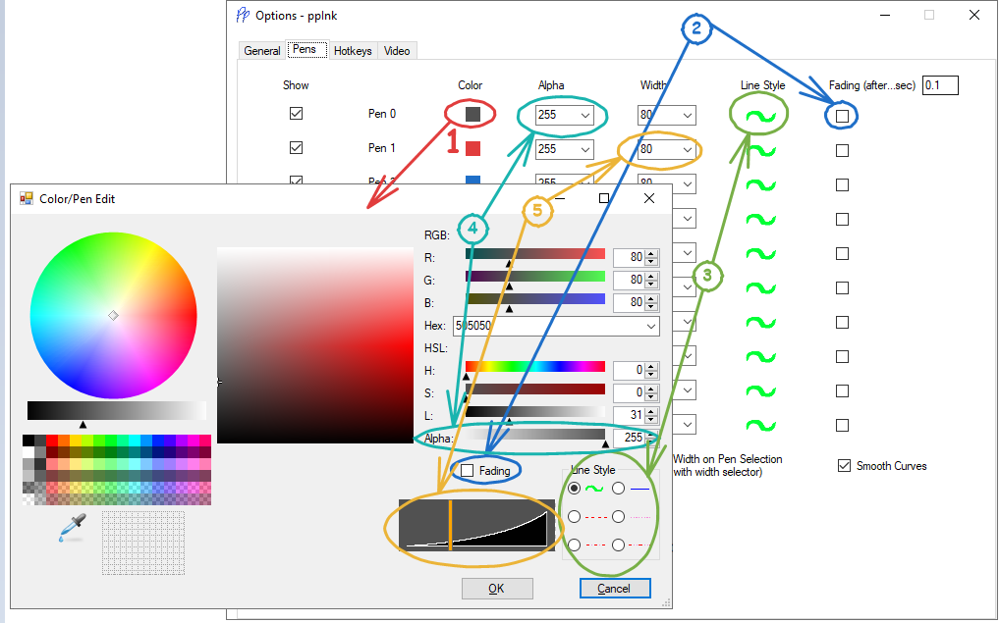

 #### Introduction

ppInk is an on-screen annotation software under Windows, forked from gInk.

ppInk introduces many new features compared to gInk, greatly inspired by another
screen annotation software Epic Pen, but even more easy to use. ppInk / gInk are
made with the idea kept in mind that the interface should be simple and should
not distract attention of both the presenter and the audience when used for
presentations. Unlike in many other softwares in the same category, you select
from pens to draw things instead of changing individual settings of color,
transparency and tip width everytime. Each pen is a combination of these
attributes and is configurable to your need.

As another option you can use ppInk to support demonstration:

https://user-images.githubusercontent.com/4083478/119278023-16f58b00-bc23-11eb-95de-9dc16505bf43.mp4
(extract from @NOVAinc on Twitch)

This tool is intended to be usable through mouse,tablet pen(taking into pressure) but also throug touchscreen or graphic tablet. 

A set of drawing tools are introduced: Hand Writing, Line (2 points and polyline), Rectangular,
Ellipsis, Arrow, Numbering Tag, Text Left/Right aligned, cliparts

In order to reduce the number of buttons, some buttons have multiple functions,
selected my multiple click on those or some through long click (**or right click as an alternative**):

-   Pen:
    Short click : select Pen
    Long Click : Open the pen parameters dialog

-   Hand / Rectangular / Ellipsis :  
    unfilled drawing -\> filled with pen color -\> filled with white -\> filled
    with black
    
-   Line:
    2 points -\> polyline -\> pen color filled polygon -\> white filled polygon -\> black filled polygon

-   Numbering :  
    transparent background -\> edit tag Number -\> white background -\> black background

-   Arrow :
    Arrow draw at the beginning -\> Arrow draw at the end
    
    (*) : head position when tool is first selected can be modified by option

-   Text:  
    Text left aligned -\> Text Right aligned
    You can now use ctrl+enter to validate the entry

-   Move:  
    Move 1 drawing -\> Copy 1 drawing -\> Move all drawings.
    
-   Edit:
    Short click : modify text/number tool (text and font) *or* the color/pen width of a stroke
    Long click : edit default font (for the time of the session)
    if some strokes are selected before short click, the pen/color dialog will open to modify all selected strokes at once.

-   Lasso:
    Allow selection of multiple stroke either with the lasso, or clicking on strokes (surrounded). left click for lasso/selection will add to selection, and right click will substract (for touchscreen, remember that longclick is engaging rightclick).\
    Each time you click on lasso tool or use shortcut the selection is reset.
    Once you have just added a stroke with the lasso, you can use undo to cancel this selection modification
    In lasso mode, the global length is reported in a tooltip.
    After lasso selection, you can:
    * engage Erase to delete selection
    * engage move/copy to move/copy selection
    * engage edit to modify color/line style/width of the selected strokes

-   Pointer Mode (arrow cursor):
    Short click : engage Pointer Mode
    Long click : engage Window mode (Open a window) or click( to come back to fullscreen) 

-   Pen Width:
    Short click : select Pen Width
    Long click : engage **color picker**: this functions allow to modify the current pen color picking up a color on screen; in this mode mousewheel modifies transparency 

-   Cliparts:
    Open the dialog to select image and the background/frame. This list displayed of cliparts is initialized from the list defined 
    in the options. you can overload adding images for the inking sessions from files or from the clipboard.
    you can then stamp the images. you just click, the image will be stamped with the images original size. 
    if you just draw a vertical or horizontal line, the image will be drawn with the drawn width/height respecting 
    proportional size. else you can draw a box which will define the image size (non proportional). 
    If you draw from bottom/right to up/left, the image will be stamped reversed.
    
    3 preset cliparts are also available: they can be configured in the option dialogbox, or for the time of the session through a right or long
    click on the selected button.
    
    **Animated Cliparts are now supported**: APNG and animaged-GIF are supported. By default animations are supported forever. you can specify duration or loops using square brackets: negative means the object will be destroyed at the end. x after the number means, the number indicated information in loop percent. eg:
       ppInkClipart.png -> animated for ever
       ppInkClipart[5.2].png -> animated for 5.2 sec and then animation stops
       ppInkClipart[-3.1].png -> animated for 3.1 sec and then disappear
       ppInkClipart[3.5x].png -> animated for 3 cycles and a half and then animation stops
       ppInkClipart[-2x].png -> animated for 2 cycles and then disappear
    
-   Snapshot:
    Short click : Take a snapshot and exit after
    Long click : Take a snapshot and return to inking mode (keeping data); use alt+Hokey to do that with keyboard 
    note that an option is available to invert behaviors between Long and short click

*Magnetic*

The magnet activates some magnetic effect :
-   Find a point on the drawing next to the cursor. For rectangles, magnetic
    effect is available to vertices, and also to the middle of sides.(also activated pressing Ctrl)
-   The 8 points of the bounding rectangle of a text.(also activated pressing Ctrl)
-   On the line from the origin. The lines are horizontal,vertical and every 15°.(also activated pressing Shift)
The Magnetic distance can be adjusted in the options.
If only Ctrl or Shift is depressed, the global magnetic effect is switched off to only take into account the magnetic of the pressed key.
Hotkeys are availables for all tools,pens (configurable throught right click on icon next to clock)

*Move one -> Move All(pan) -> Copy one*

 You can move one stroke when clicking first time on the button. The stroke to be moved/copied will be surrounded by a rectangle to identify it and gets its measurement
 When in Move one/Copy one or Erase, when the cursor flies over a shape, a tool tip indicates the length of the stroke. if the stroke is a 3 point polyline, it will also indicates the drawn angle.

*Zoom*

Two zoom can be activated (multiple clicks on the zoom buttom). the first one offers a standard dynamic window following the cursor. with the second one, you select the area that you want to enlarge. this area will be frozen and then full displayed on the screen. You can then carry on drawing on this new enlarged background image. a new click will end working on this image and will show back the screen and will restore the previously drawn strokes.

*Save / Load*

through those two buttons, you will be able to store(in a text format) the current strokes. Load redraw the saved strokes onto the existing drawing.
- Save button  : a long click(or first short click) is a sort of "save as" : it open the dialog box and will allow you to select the filename. the following short clicks will overwrite the strokes into the previously named file.
note that a backup is done when inking is ended/quit.

Load button : a long click(or first short click) is a sort of "load as" : it open the dialog box and will allow you to select the filename. the following short clicks will load the strokes from the previously named file. at first click the file loaded is the autosave(from latest session).

**Keep in mind that an automatic save is performed when closing inking mode in autosave.strokes.txt . If you have ended your drawing session by error, you can recall your work depressing load button immediately after opening session**

*Alt+ shortcut for temporary commands:*

When this option is activated (yes by default), when Alt is pressed and hold, the tool/pen/mode is temporary selected, left when alt is released
eg : with Hand drawing selected, press Alt and keep it  down. Press and release R : rectangle is active, as long as Alt is depressed, and Hand will be reengaged when Alt is released
This can be reset any combinaisons of Pens and Tools : eg : press Alt, you can engage Filled Blue rectangle, depressing R twice, and 3 (in any order), and return to previous tools/color releasing Alt
Alt also works with dash line selection or fading shortcut.
This can be also used with Erasor
when pressing down Alt, the cursor is also temporary change to the big arrow to ease finding it on screen.

*Option Capture at toolbar opening*

Capture can be engaged as toolbar is opened. This option is set to false by default.

*Long left click/Right click on Pens*

Open the Modify pen dialog box for that pen

*Clear Board (Bin icon):*

short click : Delete all drawings and apply last selected background
Long click : Delete all drawings and select background surface color (white/black/customed color(modifiable through Options))
In options you will be able to select a default mode at opening , and customed color
advice : the created rectangle can be deleted using the erasor next to the border of the screen.

*Pens specials*

through the options or long click on a pen button, or using the edit pen hotkey you can edit advance pen:

 
- Fading : the stroke drawn will disappear after the defined time(adjustable in options dialogbox/pen tab)
- Line Style (Stroke/Solid/Dash/Dot/DashDot/DashDotDot) : This will apply the define line style on all type of drawings. Stroke keeps the original drawing which uses the pen pressure to adjust the width. Solid,Dash,... ignore pen pressure. 

Note1 :  When drawing with dashed lines,try to not draw too slowly : the number of vertex will increase and make the drawing not very nice
Note2 : Hotkeys allows to set/unset the fading, linestyle, increase/decrease penwidth and open the pen modify dialog of the current pen

A global option exists also to set/unset smoothing. When off, strokes drawing will not be smoothed. General recommendation is to leave this option on.

*color picker*

When activated (hotkey or long press on pen width button) : a pickup tool will be available to pickup from screen a color and set it (on mouse click release) to current pen. When in this mode, the mouse wheel will allow to adjust transparency. 

*cursor files:*

You can configure you own cursor file, saving it as cursor.ico in your exe folder (click position and size are loaded from the file). In the same you can save an image as FloatingCall.png to define the calling form image(in this case the width and transparency are in the Window_POS parameter in config.ini

*mouse wheel:*

Mouse wheel allows you mainly to modify the pen width. this can be easily observed with the tipped cursor. in this configuration, finding the mouse may be difficult to find in this configuration : you can then depress the alt key to get the arrow(or customized) cursor. When Number tool is selected, instead of change pen with, it changes the number size.
shift+mouse wheel allows to select pen
note1 : mouse wheel / shift+ mouse wheel can now be swapped (shift+mouse wheel to access pen width) : available in options / pen tab
note2 : as said above, two hotkeys are available to control width through the keyboard. 

*video recording:*

ppInk has now some capability to do some video recording. tuning is available in options/video tab :
   - basic recording with FFmpeg:
   You need to first install ffmpeg. and select the option in the video tab. In this case the button will be proposed. you can start/stop recording. Names and destination folders are defined throught the command line.
   - advanced recording with OBS-studio:
   You need to first install and configure OBS-studio(https://obsproject.com/fr/download) with OBS-websocket(https://github.com/Palakis/obs-websocket). select the required option (recording or broadcasting). with this program you will be able to start/stop broadcasting or start/pause/resume/stop video recording. file names and folders are defined in OBS-studio.
   Note : ppink is now compatible with release 4.8 of OBS-websocket. this should be fixed in very next release. for the moment,prefer to stop recording when stopping Ink mode

*UI customisation*

You add arrow.ani/cur/ico and eraser.ani/cur/ico to put your own cursors. if you use ico file the cursor is down with the file sized ( you can then put a bigger or smaller image)
toolbar Background Color can be changed in the options. currently a draw hickup make the background color incorrect during opening. transparency is currenly ignored
Button Images can be customized putting Png files in the ppink exe folder. the name to be used are the same as the one from the src folder.
When checked in the options, a secondary toolbar will open when selected some tools to access all functions/filling immediately:

The example above shows also an example with the pens on two lines (setup through options dialog box)

*Toolbar orientation*

You can now select how the toolbar will be deployed : to left/ to right or vertically to top/ to bottom

*Alt+Tab engaging Pointer*

When the option is set in the options, switching application (with alt+tab) will engage pointer mode. Also, when pointer mode is activated (by any means, ie button click, alt+tab, global short cut), the toolbar is folded automatically, and when pressing undock button, alt+tab, or global shortcut,the inking mode is restored and the toolbar is unfolded.
Note that you can still fold toolbar when drawing without engaging pointer mode with the dock button.

*Measurement tool*

When enabled, in Move one/Copy one or erase tool, the length of the selected object is provided in a tooltip.

The example shows also a very specific case where the object is a 3 point polyline, the angle is also computed.

*Window mode*

You can now run ppink in window mode (engaged through Long/Right Click on pointer icon)
In this mode ppInk is run in a window and you can access clicks or mousewheel applications out of the window:

https://user-images.githubusercontent.com/4083478/112311221-c656c580-8ca5-11eb-895b-2279366c0fc4.mp4

*snapshots in pointer mode*

when trying to annote menu opened with mouse click / contextual menus

https://user-images.githubusercontent.com/61389799/111090958-1d3bfc80-853a-11eb-91fc-04e85ed18454.mp4

(demo from @eamayreh)

you can configure shortcuts with shift/ctrl/alt with a press and hold and tap twice keys to prevent menu to close
multiple snapshots can be captured, they are pasted one over the other, in the reverse order to make a full sequence

#### Rest API

In order to allow customisation, ppInk provides now a REST API allowing control from an external program/device such as a streamdesk from Elgato or touchPortal:
Example with StreamDesk :

example with touchportal:

(thanks to @NOVAinc)

Ensure you are working with http protocol
All the API is described in the https://github.com/pubpub-zz/ppInk/raw/master/ppInk/httpRequests.rtf (provided next to ppink.exe in each release)

Note that this API returns results in JSON format that can be used for further extension.

#### Download

<https://github.com/PubPub-zz/ppInk/releases/>

#### Change log

<https://github.com/pubpub-zz/ppInk/blob/master/changelog.txt>

#### How to use

Start ppInk.exe and an icon will appear in the system tray and possible a floating window(\*)
(which can be moved using RightClick) to start drawing on screen.  
Inking is started :
 - clicking on floating icon
 - clicking on the icon in the system tray
 - using the global shortcut (ctr+alt+G by default)
 - immediately after start Pping if "--startInking" (case insensitive) has been added tocommand line
 - ppInk is run once more (no extra instance is started)

(\*) activation and position saving are available in options.

Click the exit button or press ESC to exit drawing.

#### Features

-   Compact and intuitive interface with customizable hotkeys.

-   Inks rendered on dynamic desktops.

-   Drawing tools: Hand Writing, Line, Rectangular, Ellipsis, Arrow, Numbering
    Tag, Text Left/Right aligned

-   Stylus with eraser, touch screen and mouse compatible.

-   Click-through mode. (note : once inking is engaged, global shortcut enters and exits this mode)

-   Multiple displays support.

-   Pen pressure support.

-   Snapshot support.

-   Hotkey support. (includes hotkeys with Del, BackSpace; in options **use ctrl+shift+del or ctrl+shift+backspace to delete the current hotkey**)

-   Magnetic effect when drawing shapes

-   Filled shapes

-   Video recording

-   Load/Save stroke

-   Zoom (2 versions)

#### Tips

-   There is a known issue for multiple displays of unmatched DPI settings
    (100%, 125%, 150%, etc.). If you use gInk on a computer with multiple
    displays of unmatched DPI settings, or you encounter problems such as
    incorrect snapshot position, unable to drag toolbar to locations etc.,
    please do the following as a workaround (in Windows 10 version 1903 as an
    example): right-click ppInk.exe, Properties, Compatibility, Change high DPI
    settings, Enable override high DPI scaling behavior scaling performed by:
    Application. (only after v1.0.9, which will be released soon)

-   There is a very few hidden options you can tweak in config.ini that are not
    shown in the options window.

#### How to contribute translation

gInk/ppInk supports multiple languages now (ppInk introduces a few new sentences
where internationalization has not be implemented.). Here is how you can
contribute translation. Simply create a duplication of the file "en-us.txt" in
"bin/lang" folder, rename it and then translate the strings in the file. Check
in ppInk to make sure your translation shows correctly, and then you can make a
pull request or use https://github.com/pubpub-zz/ppInk/issues/17 to propose your translation 
for the next version of release for others to use.

NEW :  arabic available

gInk  
https://github.com/geovens/gInk  
https://github.com/geovens/gInk  
Weizhi Nai \@ 2019

ppInk
https://github.com/pubpub-zz/ppInk
Pubpub-ZZ \@ 2020

