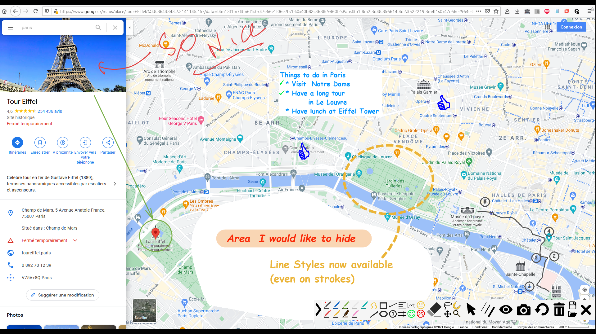

#### Introduction

ppInk is an on-screen annotation software under Windows, forked from gInk.

ppInk introduces new features compared to gInk, greatly inspired by another
screen annotation software Epic Pen, but even more easy to use. ppInk / gInk are
made with the idea kept in mind that the interface should be simple and should
not distract attention of both the presenter and the audience when used for
presentations. Unlike in many other softwares in the same category, you select
from pens to draw things instead of changing individual settings of color,
transparency and tip width everytime. Each pen is a combination of these
attributes and is configurable to your need.

A set of drawing tools are introduced: Hand Writing, Line, Rectangular,
Ellipsis, Arrow, Numbering Tag, Text Left/Right aligned

In order to reduce the number of buttons, some buttons have multiple functions,
selected my multiple click on those:

-   Hand / Rectangular / Ellipsis :  
    unfilled drawing -\> filled with pen color -\> filled with white -\> filled
    with black

-   Numbering :  
    transparent background -\> edit tag Number -\> white background -\> black background

-   Arrow :
    Arrow draw at the beginning -\> Arrow draw at the end
    
    (*) : head position when tool is first selected can be modified by option

-   Text:  
    Text left aligned -\> Text Right aligned

-   Move:  
    Move 1 drawing -\> Move all drawings.

The magnet activates some magnetic effect :

-   Find a point on the drawing next to the cursor. For rectangles, magnetic
    effect is available to vertices, and also to the middle of sides.(also activated pressing Ctrl)

-   The 8 points of the bounding rectangle of a text.(also activated pressing Ctrl)

-   On the line from the origin. The lines are horizontal,vertical and every 15°.(also activated pressing Shift)

Hotkeys are availables for all tools,pens (configurable throught right click on icon next to clock)

#### Screen Shots

screenshot

#### Download

<https://github.com/PubPub-zz/ppInk/releases/>

#### How to use

Start ppInk.exe and an icon will appear in the system tray and possible a floating window(\*)
(which can be moved using RightClick) to start drawing on screen.  
Inking is started :
 - clicking on floating icon
 - clicking on the icon in the system tray
 - using the global shortcut (ctr+alt+G by default)
 - immediately after start Pping if "--startInking" (case insensitive) has been added tocommand line
 - ppInk is run once more (no extra instance is started)

(\*) activation and position saving are available in options.

Click the exit button or press ESC to exit drawing.

#### Features

-   Compact and intuitive interface with customizable hotkeys.

-   Inks rendered on dynamic desktops.

-   Drawing tools: Hand Writing, Line, Rectangular, Ellipsis, Arrow, Numbering
    Tag, Text Left/Right aligned

-   Stylus with eraser, touch screen and mouse compatible.

-   Click-through mode. (note : once inking is engaged, global shortcut enters and exits this mode)

-   Multiple displays support.

-   Pen pressure support.

-   Snapshot support.

-   Hotkey support.

-   Magnetic effect when drawing shapes

-   Filled shapes

#### Tips

-   There is a known issue for multiple displays of unmatched DPI settings
    (100%, 125%, 150%, etc.). If you use gInk on a computer with multiple
    displays of unmatched DPI settings, or you encounter problems such as
    incorrect snapshot position, unable to drag toolbar to locations etc.,
    please do the following as a workaround (in Windows 10 version 1903 as an
    example): right-click ppInk.exe, Properties, Compatibility, Change high DPI
    settings, Enable override high DPI scaling behavior scaling performed by:
    Application. (only after v1.0.9, which will be released soon)

-   There are a few hidden options you can tweak in config.ini that are not
    shown in the options window.

#### How to contribute translation

gInk/ppInk supports multiple languages now (ppInk introduces a few new sentences
where internationalization has not be implemented.). Here is how you can
contribute translation. Simply create a duplication of the file "en-us.txt" in
"bin/lang" folder, rename it and then translate the strings in the file. Check
in ppInk to make sure your translation shows correctly, and then you can make a
pull request to merge your translation to the next version of release for others
to use.

gInk  
https://github.com/geovens/gInk  
https://github.com/geovens/gInk  
Weizhi Nai \@ 2019

ppInk

<https://github.com/pubpub-zz/ppInk>
